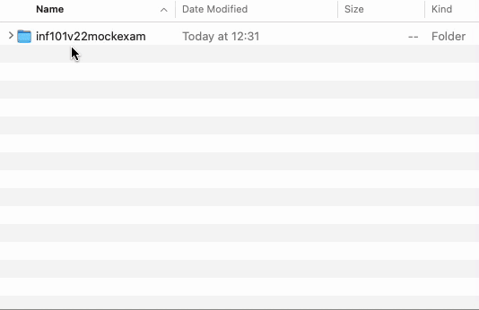

# Kode til prøveeksamen INF101 våren 2022

I dette repositoriet finner du kode til følgende oppgaver:
 - Kjøleskap -oppgaven
 - Set -oppgaven
 - Traffiklysoppgaven ([guide](./traffic-guide.md))

# FridgeTest (5 poeng)

I lab2 implementerte vi et kjøleskap. For å få godkjent på denne oppgaven måtte testene i  passere, men testene i `FridgeTest` var nok ikke fullt så dekkende som man kunne ønske seg. 

I dette repositoriet finner du to implementasjoner av `IFridge`, nemlig `Fridge` og `EasyFridge`. Klassen `Fridge` er en implementasjon som gjør hva dokumentasjonen i `IFridge` beskriver og dermed passerer testene i `FridgeTest`. `EasyFridge` gjør derimot ikke alltid hva dokumentasjonen beskriver, men passerer testene likevel. 

Legg til en test i `FridgeTest` som vil avsløre at `EasyFridge` ikke oppfører seg som den skal. Testen du legger til må passere for `Fridge`, men skal feile for `EasyFridge`. Testen skal være hensiktsmessig for å teste funksjonaliteten av et kjøleskap implementert slik grensesnittet `IFridge` beskriver.

*I denne oppgaven skal du kun endre på [FridgeTest.java](./src/test/java/inf101v22/mockexam/fridge/FridgeTest.java).*

# Set/mengde (10 poeng)

En [mengde](https://no.wikipedia.org/wiki/Mengde) (engelsk: [set](https://en.wikipedia.org/wiki/Set_(mathematics) )) er en uordnet samling av elementer uten duplikater. Med andre ord, et sett er som en liste, men vi bryr oss ikke om rekkefølgen på elementene og vi tillater ikke flere like elementet.

I dette repositoriet finner du et grensesnitt `ISet`. Opprett en klasse `Set` som implementerer `ISet` og implementerer alle metodene til å gjøre hva dokumentasjonen beskriver. Settet må være implementert for en generisk type. Bruk `ArrayList` som underliggende datastruktur for å implementere klassen. 

Selv om det er bedre egnede datastrukturer for formålet tilgjengelig i Java sitt standard-bibliotek (for eksempel `HashSet` og `TreeSet`), <u>må</u> dere bruke `ArrayList` for å lagre elementene i denne oppgaven. Det vil ikke gi ekstra uttelling å ha en super-effektiv implementasjon, det holder at den er korrekt for å få full uttelling. Bruk av andre datastrukturer enn `ArrayList` eller arrays vil resultere i null poeng.

# Trafikklys (30 poeng)

Følg [traffic-guide.md](./traffic-guide.md) og lag en applikasjon som simulerer et trafikklys.

# Levering av kodeoppgaver

For å levere inn kodeoppgavene på eksamen må du lage en .zip -fil av *mappen* som inneholder repositoriet. Med andre ord, du skal *ikke* markere alle filene i mappen og zippe dem, men velge *selve mappen* når du lager zip-filen.

Prosedyren for å gjøre dette er nesten identisk på både Mac, Windows og Ubuntu, og består i å høyre-klikke på mappen, og velge compress/send to zip.

