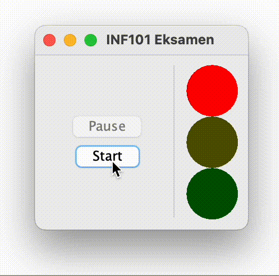

## Trafikklys



I denne oppgaven skal du lage en applikasjon som simulerer et trafikklys som endrer seg i et fast mønster. Applikasjonen vil ha knapper for å starte og pause mønsteret.

Denne oppgaven består av tre deler, (a), (b) og (c). For å kunne begynne på del (b) må du ha gjort oppgave (a) først; men, det er ikke strengt nødvendig at `goToNextState` -metoden i (a) er implementert *riktig* for å fortsette på steg b.

### (a) Modellen (10 poeng)
Implementer en klasse `TrafficLightModel` i pakken *traffic.model*. Klassen skal implementere grensesnittet `TrafficLightControllable`.

Testene for denne klassen finnes allerede i `TrafficLightModelTest`. Du velger selv hvordan du vil implementere klassen, og du står fritt til å opprette flere filer/klasser/strukturer som støtte dersom du ønsker. Kikk på grensesnittene og les testene nøye for å se hvilke verdier som skal returneres.

>Merk at klassen `ControlledObservable<E>` implementerer grensesnittet `Observable<E>`. Returtypen til noen av metodene du skal implementere er `Observable<Boolean>`. Da kan det være lurt å ha feltvariabler i modellen din av typen `ControlledObservable<Boolean>` som du enkelt kan returnere i disse metodene. Les forøvrig eksempel på bruk i javadocs til ControlledObservable.

- [ ] Du er ferdig med dette steget når alle testene i `TrafficLightModelTest` passerer.

### (b) Visning (12 poeng)

Ved å kjøre `App` i pakken *traffic* vil du se et delvis skjelett for applikasjonen, men i stedet for et trafikklys ser vi bare knappene for start og pause, samt en tekst *"TODO"* som vi nå skal erstatte med et traffiklys. I dette steget skal vi opprette visningen for selve trafikklyset. Du skal følge guiden så nøyaktig som mulig, men du må kanskje gjøre noen mindre avgjørelser selv der guiden er mer vag i sine beskrivelser.

> Merk at beskrivelsen her er skrevet *top-down*, altså at de mest abstrakte sammenhengene er forklart først, mens detaljene blir forklart senere. Med en slik forklaring er det enklere å forstå de store sammenhengene og formålet; men når man koder er det kanskje lettest å jobbe *bottom-up*. For eksempel forklarer vi *TrafficLightView* før vi forklarer *LampView*, men når du koder kan det være enklest å skrive *LampView* først.

 - [ ] `Root` må ha tilgang til en modell for å kunne tegne den. Utvid derfor konstruktøren med en parameter av typen `TrafficLightViewable` som representerer modellen.
 - [ ] Opprett et nytt `TrafficLightModel` -objekt i `App` og gi det som argument ved oppretteslesen av `Root`.
- [ ] I `Root` er det en instans-variabel `demoView` som blir initialisert med et `JLabel` -objekt. Denne linjen må vi endre slik at vi istedet initialiserer den med et objekt som tegner et trafikklys (i.e. et TrafficLightView -objekt som beskrevet under).

Vi skal opprette to filer i pakken *traffic.view*:

 - [ ] En klasse `TrafficLightView` som utvider `JComponent`. Denne klassen tegner et trafikklys.
 - [ ] En klasse `LampView` som også utvider `JComponent`. Denne klassen tegner en enkelt lampe i et trafikklys.

#### TrafficLightView
 Klassen TrafficLightView er enkelt og greit en samling av tre LampView -komponenter. I konstruktøren til `TrafficLightView`:

 - [ ] La det være en parameter av typen `TrafficLightViewable`. Dette er modellen vi skal tegne.
 - [ ] La objektet bruke en vertikal BoxLayout:
 ```java
 this.setLayout(new BoxLayout(this, BoxLayout.Y_AXIS));
 ```
 - [ ] Opprett tre `LampView` -objekter, ett for hvert av det røde, gule og grønne lyset. 
 - [ ] Benytt `add` -metoden som er arvet fra `JComponent` for å legge hver av dem til som underkomponenter til dette TrafficLightView -objektet (eksempel på en lignende situasjon kan sees på slutten av initLayout -metoden i Root -klassen).

#### LampView
Det gjenstår å forklare hvordan vi viser en enkelt lampe. I `LampView` -klassen:

 - [ ] La konstruktøren ha parametere av typen `Observable<Boolean>` og `Color`, og lagre disse som feltvariabler.
 - [ ] La konstruktøren legge til `this::repaint` som observatør på `Observable<Boolean>` -objektet. Dette vil sørge for at repaint blir kalt hver gang verdien i observable -objektet endrer seg (les javadoc til ControlledObservable og kikk på ObservableTest for eksempeler på hvordan dette gjøres).
 - [ ] Overskriv (@Override) metoden som har signaturen `paintComponent(Graphics)`, og skriv kode for å tegne en lampe:
    - [ ] Husk at det er god praksis å kalle super.metodeNavn når man overskriver en metode, dette vil da utføre alt som ellers hadde blitt gjort dersom du ikke overskrev metoden.
    - [ ] Benytt `setColor` -metoden på *Graphics* -objektet for å bestemme fargen. La fargen være den som ble gitt under konstruksjon dersom boolean-verdien du observerer er true, og la den være svart eller en (mye) mørkere versjon av denne fargen hvis ikke (tips: Color-objekter har en metode som heter `darker` -- den kan også kalles flere ganger.).
    - [ ] For å tegne en runding, benytt `fillOval` -metoden på *Graphics* -objektet. Gi argumentene `0, 0, getWidth(), getHeight()` for å tegne rundingen over hele området.
 - [ ] Overskriv metoden `preferredSize()` som returnerer en `Dimension` og returner dimensjonen (50, 50).

 > Merk: `Color`, `Graphics` og `Dimension` må importeres fra pakken *java.awt*, mens `JComponent` og `BoxLayout` importeres fra pakken *java.swing*.

 - [ ] Du er ferdig med steg (b) når du kan kjøre App og blir vist et traffiklys som lyser rødt.

### (c) Kontrollen (8 poeng)

I dette steget skal vi opprette en kontroller for trafikklyset. Vi vil først knytte kontrollen til modellen og la lyset gå automatisk gjennom tilstandene sine, før vi deretter knytter til knappene fra visningen inn i kontrolleren.

#### Periodisk endring automatisk

 - [ ] I pakken *traffic.controller*, opprett en klasse `TrafficLightController`.
 - [ ] La konstruktøren ha en parameter av typen `TrafficLightControllable` som representerer modellen, og lagre denne som en feltvariabel.
 - [ ] La klassen også ha en feltvariabel av typen `java.swing.Timer` (pass på å importere denne fra riktig pakke), og initialiser den i konstruktøren:
    - [ ] Det *første* argumentetet til timeren er hvor lenge timeren skal vente før den gjør noe. Hent ut riktig verdi fra modellen og bruk den verdien.
    - [ ] Det *andre* argumentet til timeren er et objekt av typen `ActionListener`, og indikerer hva som skal skje når timeren fyrer av. Merk at `ActionListener` er et grensesnitt med kun én metode, og det er derfor mulig å ta en hvilken som helst metode med samme parametere og returtype og "pakke inn" den metoden som et ActionListener -objekt. Metoden til en ActionListener er `void actionPerformed(ActionEvent e)`. Gjør derfor følgende:
        - [ ] Opprett en metode `private void timerFired(ActionEvent e)` (legg merke til at denne metoden har samme parametertyper og returtype som actionPerformed).
        - [ ] La `this::timerFired` bli gitt som det andre argumentet til Timer-konstruktøren (under panseret vil dette pakke metoden timerFired inn i et objekt som implementerer `ActionListener`).
- [ ] I metoden `timerFired`, gjør et kall til `goToNextState` på modellen.
- [ ] På slutten av konstruktøren, gjør et kall til `start` på timeren.

For å knytte ting sammen, trenger du å opprette et kontroller-objekt. Dette gjøres i `App`. La modellen du har opprettet der tidligere bli gitt som argument når du oppretter kontrolleren.

- [ ] Du skal nå kunne kjøre programmet og se trafikklyset periodisk endre seg.

Foreløpig vil timeren fyre løs periodisk uten å ta hensyn til at ulike faser skal ha ulik lengde. For å løse dette må vi endre på `timerFired` -metoden:
 - [ ] Etter kallet til `goToNextState`, hent ut delay på nytt. Kall så `setInitialDelay` og `restart` på timeren. Når du kjører programmet nå, skal lengden på de ulike fasene respekteres.

 #### Pause styrt av bruker

  - [ ] La `TrafficLightController` implementere grensesnittet `ITrafficGuiController`. Implementer metodene på en fornuftig måte. Det er helt greit at timeren starter helt på nytt hver gang noen trykker på start.
  - [ ] Gi kontrolleren som argument til Root.
  - [ ] Alt skal nå fungere bra! Om du har kommentarer til din egen implementasjon du ønsker sensor skal lese, skriv dem i [comments.md](./comments.md) (hvis du har problemer med å editere, kan du endre navn på filen til comments.txt).